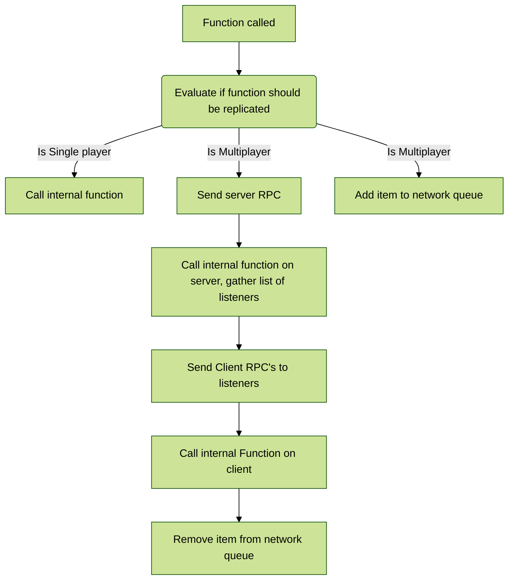

# How does the networking work?

---
## Listeners

Certain inventory data can become quite large, especially with how many containers and items you allow in an inventory. To optimize, we try to simplify things. Players only receive data from components that they request data from and data from their own components, but also any update from components they are currently interacting with.

The component keeps track of the players that are currently interacting with a component with the <span style="color:slateblue">**Listeners**</span> array, then whenever PlayerA moves, adds, removes or interacts with an item in some way, the component sends RPC calls to the other "listeners" so their widgets and data get updated.

For functions that modifies a components data, such as moving an item or modifying an items stack count or modifying any other data, you must remember that clients only have authority over their own component, they do not have authority over other components and thus can't call functions on other components. This is simply how networking in Unreal Engine works.
Because of this, most functions require you to call the function on the component the client has authority over. Even though the item you are trying to modify is not on that component.
This is why, when you look at some of the source code, the functions are getting the component the item belongs to through its <span style="color:slateblue">**UniqueID**</span>.<span style="color:slateblue">**ParentComponent**</span> and modifying that component's data through the component the client has authority over.

To simplify the code, any function that attempts to automate the replication for you stores its logic in a function with the same name but with a **Internal_** prefix.

For most functions that modify data in some way, only a single version of that function is available for you to call, and that function handles the replication for you. This is to simplify the amount of functions exposed as it can get very daunting to try and handle every replication scenario and making sure your calling the right function. If you wish to modify how the replication is handled, you can always go into the functions, modify them, or enable the server/client/internal functions to be BlueprintCallable.



==- Code example


```C++
void IncreaseItemCount(FS_InventoryItem Item, int32 Count, int32& NewCount)
{
    if(UKismetSystemLibrary::IsStandalone(this))
	{
        //Single player, don't bother with any replication stuff
		InternalIncreaseItemCount(Item.UniqueID, Count, NewCount);
		return;
	}

    //Update server data
	S_IncreaseItemCount(Item.UniqueID, Count);

    //Predict the result if item is stackable.
	if(Item.Item->CanItemStack() == true)
	{
		NewCount = FMath::Clamp(Item.Count + Count, 1, Item.Item->MaxStack);
	}
	else
	{
		NewCount = Item.Count;
	}
    
    //Notify the player the item is currently busy
	C_AddItemToNetworkQueue(Item.UniqueID);
}

void S_IncreaseItemCount(FS_UniqueID ItemID, int32 Count)
{
    int32 NewStackCount
    if(GetOwner()->GetRemoteRole() == ROLE_SimulatedProxy) //This is dedicated or listen server. Don't bother with client RPC
	{
		InternalIncreaseItemCount(ItemID, Count, NewStackCount);
	}
	else //Client is calling, update server, then call client RPC
	{
		InternalIncreaseItemCount(ItemID, Count, NewStackCount);
		C_IncreaseItemCount(ItemID, Count);
	}
	
	for(const auto& CurrentListener : ItemID.ParentComponent->Listeners)
	{
		//Update all clients that are currently listening to this component's replication calls.
		if(CurrentListener->GetOwner()->GetRemoteRole() == ROLE_AutonomousProxy && CurrentListener != this)
		{
			CurrentListener->C_IncreaseItemCount(ItemID, Count);
		}
	}
}

void C_IncreaseItemCount_Implementation(FS_UniqueID ItemID, int32 Count)
{
    //Find the item we are processing
	bool ItemFound;
	FS_InventoryItem Item;
	ItemID.ParentComponent->GetItemByUniqueID(ItemID, ItemFound, Item);
	if(ItemFound)
	{
		int32 NewStackCount;
		InternalIncreaseItemCount(ItemID, Count, NewStackCount);
        //Item has been processed, remove from network queue
		C_RemoveItemFromNetworkQueue(Item.UniqueID);
	}
}

void UAC_Inventory::InternalIncreaseItemCount(FS_UniqueID ItemID, int32 Count, int32& NewCount)
{
    //Start moodifying the item in here
}
```
===

### Why not just use a multicast?

Because of how large some RPC's can get, I did not find multicasts to be acceptable for most of the functions. A lot of the RPC's are just simply not relevant for most clients anyways, and managing relevancy is a lot more complicated than a simple array of actors.

---
## Unique ID

The UniqueID is a simple method to quickly find containers or items, or ensuring containers or items are valid, and for linking some object to an item (Such as the [item driver's](https://inventoryframework.github.io/classes-and-settings/o_itemobjectandac_itemdriver/)). This is covered in multiple sections in the documentation, but here are some things to consider for networking.

- Clients are unable to generate UniqueID's. If a function requires the client to assign a UniqueID to an item or a container, it must receive it from the server. You can see an example in <span style="color:violet">**AC_Inventory.h**</span> -> <span style="color:brown">**TryAddNewItem**</span>
- UniqueID's [scale extremely](https://inventoryframework.github.io/workinginthesystem/creatingcustomfunctions/#network-optimizations) well with RPC's. It is advised to use UniqueID's as often as possible.
- There's no way to evaluate from a UniqueID if it was assigned to an item or container without going through all items and containers until you find a match. It is not recommended to add more information to this struct as it's meant to be small and simple, so that it gets replicated extremely quickly and cheaply.